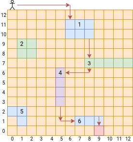
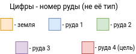
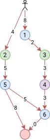

# Описания работы алгоритма

## Задача

Найти **кратчайший** путь от начального положения человечка до специального вида руды (портал в ад), передвигаясь между жилами (участки руды одного типы).

## Описание алгоритма

 

> Приведённый путь является возможным, но не оптимальным.

- Передвижения по земле (одна клетка - одна у.е.) составляет стоимость маршрута от одной жилы до другой.

- Передвижения внутри одной жилы ничего не стоит. Как следствие, понимаем, что выгоднее передвигаться внутри жилы, как можно дольше на пути к целе.

Используемые обозначения приведены ниже:

> Тип руды в условии задания не играет роли.

Граф, полученный из данной карты, выглядит следующим образом:

