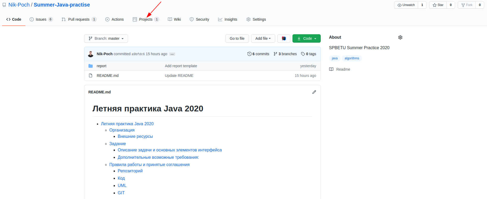
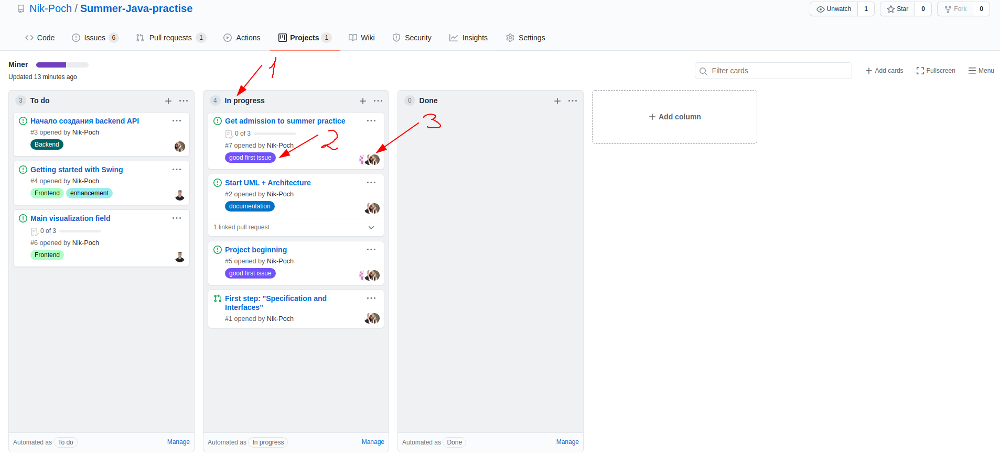
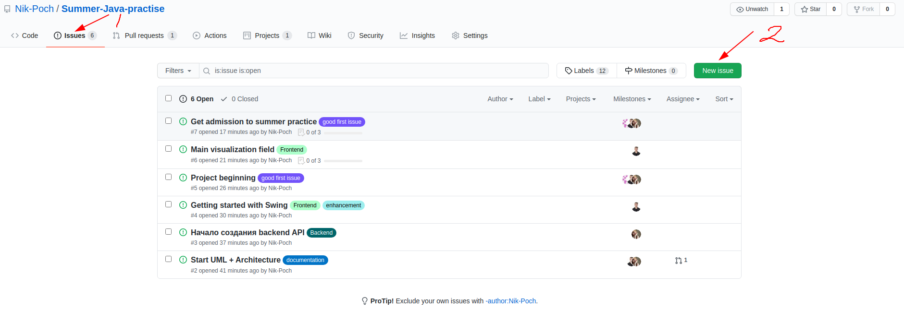
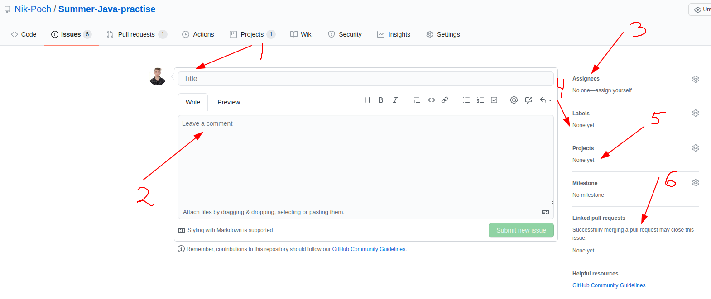

# Летняя практика Java 2020

- [Летняя практика Java 2020](#летняя-практика-java-2020)
  - [Организация](#организация)
    - [Внешние ресурсы](#внешние-ресурсы)
  - [Задание](#задание)
    - [Описание задачи и основных элементов интерфейса](#описание-задачи-и-основных-элементов-интерфейса)
    - [Дополнительные возможные требования:](#дополнительные-возможные-требования)
  - [Правила работы и принятые соглашения](#правила-работы-и-принятые-соглашения)
    - [Репозиторий](#репозиторий)
    - [Код](#код)
    - [UML](#uml)
    - [GIT](#git)

## Организация

Состав команды:

* Мария Лисок, группа 8381.

* Дмитрий Перелыгин, группа 8381.

* Почаев Никита, группа 8381.

Распределение ролей:

> Важность ролей и % участия распределяются по нисходящей: чем раньше идёт роль, тем большее участие в ней принимает участник.

* Никита: лидер, алгоритмист, документация;

* Мария: алгоритмист, тестировщик, документация;

* Дмитрий: фронтенд, документация, тестировщик.

### Внешние ресурсы

- Работы с UML ведётся на [Google Drive](https://drive.google.com/drive/folders/1PkiIVvs_va-AYD_eyzI6fmFJwQqqZouP?usp=sharing).

- [Таблица](https://docs.google.com/spreadsheets/d/1uBlZJoT_RPJDxgbZJWhwGqDrvCUeCLFpYWFIxlxnnKU/edit#gid=0) с успеваемостью.

## Задание

### Описание задачи и основных элементов интерфейса

Визуализируется разрез земли (2д сбоку) с рудами (а-ля майнкрафт). Человечек стоит сверху с определённого вида инструментом (или с несколькими). Требуется найти минимальный путь от текущего положения человечка до портала в ад (выделяется на карте специальнным образом), передвигаясь при этом только между жилами руд. При нажатии на кнопку визулизируется путь на начала к порталу, есть возможность пошагово просмотреть ход движения человечка. Другая кнопка подсвечивает найденные на карте жилы каким-либо образом.

Ресуры появляются в виде жил. Жила - блоки одинковой руды, транзитивно соприкасающиеся друг с другом хотя бы одной стороной. Расстоние от жилы до жилы: минимальное расстояние между ближайшими блоками соотвествующих жил (при наличии диагонали - лесенка). Таким образом каждая жила представляется в виде веришины, а расстояние между ними - ребро с весом. Граф получится полным. Карты хранятся в виде файлов с массивами данных. Нахождение жил и расстония требуется находить.

### Дополнительные возможные требования:

- Определение пользователем различных инструментов и влияния на возможность добычи этой руды (например, каменная кирка не добывает алмазы -> мы не учитваем алмазные жилы при постронении графа)

- При нажатии на жилу в начальном состоянии визуализируются кратчайшие пути от неё до других жил

- Добавление режима создания случайной карты

- Сохранение/загрузка/редактирование карт

- Между блоками могут генерироваться непроходимые блоки (в этом случае придётся искать кратчайшие пути между жилами не вычитанием координат, а алгоритмом поиска).

## Правила работы и принятые соглашения

### Репозиторий

Для одного логического фрагмента работы создаём отдельный commit. Работы над каждым task'ом ведётся в отдельной ветке и затем проходит code review от других членов команды.

В данном разделе находится roadmap проекта и текущий процесс работы в формате [канбан доски](https://ru.wikipedia.org/wiki/%D0%9A%D0%B0%D0%BD%D0%B1%D0%B0%D0%BD-%D0%B4%D0%BE%D1%81%D0%BA%D0%B0).

У каждой задачи есть:

1. Текущее состояние (прогресс).

2. Тег выполнения, полный список которых можно увидеть в выпадающем списке при редактировании. Их можно использовать для сортировки, а также для того, чтобы взять задачу по своей зоне ответсвенности.

3. Участником, которые уже занимаются выполнением данной задачи.

Для создания новой задачи необходимо зайти в разде Issue (1) и создать новый экземпляр (2).

При создании новой задачи необходимо указать следующие параметры:

1. Заголовок, где кратко описать выполняемую задачу

2. Тело задачи с более подробным описанием.

3. Участники, которые принимают / должны принять участие.

4. Лейблы данной задачи. Пожалуйста, выставляйте их внимательно.

5. Выбрать проект, к которому принадлежить данная задача. В нашем случае это всего Miner.

6. Если к данной задаче был создан pull request, содержащий изменений для данной задаче, то его необходимо прикрепить к текущей задачи. (Это также автоматизирует процесс закрытия task'а при закрытии pull request)

### Код

При написании комментариев придерживаемся [стандартов Oracle](https://www.oracle.com/technical-resources/articles/java/javadoc-tool.html) для Javadoc Tool. Описание пишем к каждому создаваемому классу.

### UML

Для надписей изпользуем шрифт Roboto (Google Fonts). В случае его отстутсвия подключается из блока слева.

В разделе готовых блоков есть раздел UML используем его.

Для классов описываем все методы.

### GIT

Для ознакомления про [Git Flow](https://habr.com/ru/post/106912/).

Основные ветки:

- `maser` - стабильная версия проекта (релиз)

- `develop` - текущая рабочая версия проекта

Дополнительные:

- Ветки функциональностей (Feature branches) - **создаём для каждой задачи**.

  Ветки функциональностей могут иметь _произвольные названия_, которые очень кратко описывают суть задачи, для которой они создаются. Порождается от ветки `develop` и используются для внедрения в проект дополнительных функций (фич), после чего вливается обратно в `develop`.

- Ветки исправлений (Hotfix branches)

  Название имеет вид `hotfix-*`. Если в текущей стабильной версии проекта (которая хранится в `master`) выявляется баг, который требует немедленного исправления, создаётся ветка багфикса (исправления), порождённая от `master`. После удачного исправления бага вливается в `master` и `develop`.